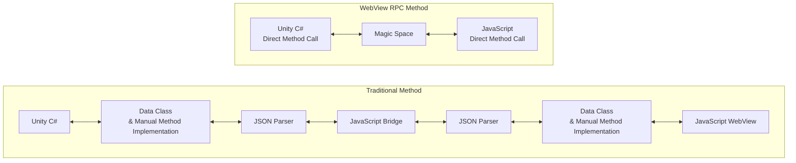
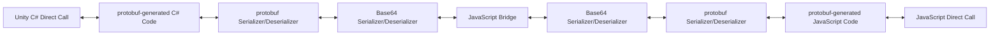

[English](README.md) | [Korean](README_ko.md)

[](https://openupm.com/packages/com.kwanjoong.webviewrpc/)
[](LICENSE.md)

# Unity WebView RPC
Unity WebView RPC provides an abstraction layer that allows communication between the Unity client (C#) and WebView (HTML, JS) using protobuf, similar to gRPC.
It extends the traditional `JavaScript bridge` communication method to make it work similarly to Remote Procedure Call (RPC).
To avoid dependency on a specific WebView library, it provides a Bridge interface so that communication can be achieved with the same code, regardless of the WebView library used.

## Architecture
WebView RPC simplifies the workflow compared to the traditional `JavaScript bridge` method.



### Internal Implementation
Internally, WebView RPC is structured as follows:



1. **Unity C# Direct Call**
    - Calls an RPC interface function like a regular method in Unity.
2. **protobuf-generated C# Code**
    - Auto-generated C# wrapper/stub from proto definition.
    - RPC methods and data structures are based on protobuf.
3. **Base64 Serializer + JavaScript Bridge**
    - Converts raw byte data to Base64 before sending it through the WebView (browser).
    - JavaScript receives the same format.
4. **protobuf-generated JavaScript Code**
    - Auto-generated JavaScript code from the same proto definition.
    - Deserializes the serialized data from C# and directly calls JavaScript methods.

With WebView RPC, method calls between C# and JavaScript behave like regular function calls, significantly reducing the need for repetitive JSON parsing and bridge implementations. This structure becomes even more maintainable as the project scales.

## Installation
### Adding WebView RPC to a Unity Project
1. Install the `Protobuf` package via NuGet Package Manager.
2. Install the WebViewRpc package either via Package Manager or OpenUPM.

- Add to `Packages/manifest.json`:

   ```json
  {
    "dependencies": {
      "com.kwanjoong.webviewrpc": "https://github.com/kwan3854/Unity-WebViewRpc.git?path=/Packages/WebviewRpc"
    }
  }
  ```

- Or via Package Manager:
    1. `Window` → `Package Manager` → `Add package from git URL...`
    2. Enter: `https://github.com/kwan3854/Unity-WebViewRpc.git?path=/Packages/WebviewRpc`
- Or via OpenUPM:

   ```bash
   openupm add com.kwanjoong.webviewrpc
   ```

### Adding WebView Library
- WebView RPC is not distributed as a package.
- Add the files under [Unity-WebViewRpc/Assets/StreamingAssets/MocLib](https://github.com/kwan3854/Unity-WebViewRpc/tree/main/Assets/StreamingAssets/MocLib) to your JavaScript project.

### Installing the protobuf Compiler
#### Convert protobuf files to C# and JavaScript using `protoc`.

**Mac**
```bash
brew install protobuf
protoc --version  # Ensure compiler version is 3+
```

**Windows**
```bash
winget install protobuf
protoc --version  # Ensure compiler version is 3+
```

**Linux**
```bash
apt install -y protobuf-compiler
protoc --version  # Ensure compiler version is 3+
```

### Installing the WebView RPC Code Generator
Download the latest release from the [WebViewRPC Code Generator repository](https://github.com/kwan3854/ProtocGenWebviewRpc).
- **Windows**: `protoc-gen-webviewrpc.exe`
- **Mac**: `protoc-gen-webviewrpc`
- **Linux**: Not provided (requires manual build).

## Quick Start
To demonstrate WebView RPC, we will implement a simple `HelloWorld` RPC service that receives a `HelloRequest` message and returns a `HelloResponse`.

First, let’s see an example where the C# side acts as the server and JavaScript acts as the client.

### Defining the protobuf File
- protobuf defines the structure of requests and responses for the service.
- When Unity and WebView need to communicate, define the required messages and services.
- The following example, `HelloWorld.proto`, defines `HelloRequest`, `HelloResponse`, and the `HelloService` service.

**HelloWorld.proto**
```protobuf
syntax = "proto3";

package helloworld;

option csharp_namespace = "HelloWorld";

message HelloRequest {
  string name = 1;
}

message HelloResponse {
  string greeting = 1;
}

service HelloService {
  rpc SayHello (HelloRequest) returns (HelloResponse);
}
```

For further details and complete implementation, refer to the full documentation.

