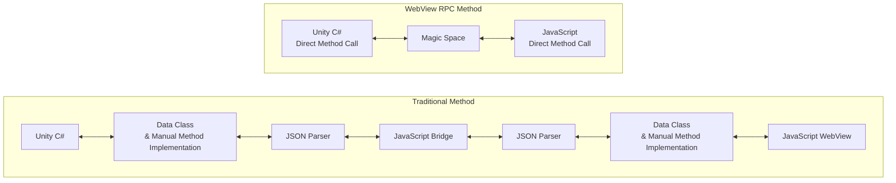
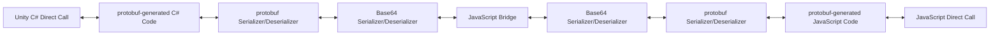

[English](README.md) | [Korean](README_ko.md)

[](https://openupm.com/packages/com.kwanjoong.webviewrpc/)
[](LICENSE.md)

# Unity WebView RPC

Unity WebView RPC provides an abstraction layer that allows communication between the Unity client (C#) and WebView (HTML, JS) using protobuf, similar to gRPC.
It extends the traditional `JavaScript bridge` communication method to work similarly to a Remote Procedure Call (RPC).
To avoid dependency on a specific WebView library, it provides a Bridge interface so that communication can be achieved with the same code, regardless of the WebView library used.

## Architecture

WebView RPC simplifies the workflow compared to the traditional `JavaScript bridge` method.



### Internal Implementation

Internally, WebView RPC is structured as follows:



1. **Unity C# Direct Call**
    - Calls an RPC interface function like a regular method in Unity.
2. **protobuf-generated C# Code**
    - Auto-generated C# wrapper/stub from the proto definition.
    - RPC methods and data structures are based on protobuf.
3. **Base64 Serializer + JavaScript Bridge**
    - Converts raw byte data to Base64 before sending it through the WebView (browser).
    - JavaScript receives the same format.
4. **protobuf-generated JavaScript Code**
    - Auto-generated JavaScript code from the same proto definition.
    - Deserializes the serialized data from C# and directly calls JavaScript methods.

With WebView RPC, method calls between C# and JavaScript behave like regular function calls, significantly reducing the need for repetitive JSON parsing and bridge implementations. This structure becomes even more maintainable as the project scales.

## Installation

### Adding WebView RPC to a Unity Project

1. Install the `Protobuf` package via NuGet Package Manager.
2. Install the WebViewRpc package either via Package Manager or OpenUPM.

- Add to `Packages/manifest.json`:

  ```json
  {
   "dependencies": {
     "com.kwanjoong.webviewrpc": "https://github.com/kwan3854/Unity-WebViewRpc.git?path=/Packages/WebviewRpc"
   }
  }
  ```

- Or via Package Manager:

    1. `Window` → `Package Manager` → `Add package from git URL...`
    2. Enter: `https://github.com/kwan3854/Unity-WebViewRpc.git?path=/Packages/WebviewRpc`

- Or via OpenUPM:

  ```bash
  openupm add com.kwanjoong.webviewrpc
  ```

### Adding WebView Library

- WebView RPC is not distributed as a package.
- Add the files under [Unity-WebViewRpc/WebViewRpcJS/RuntimeLibrary](https://github.com/kwan3854/Unity-WebViewRpc/tree/main/WebViewRpcJS/RuntimeLibrary) to your JavaScript project.

### Installing the protobuf Compiler

#### Convert protobuf files to C# and JavaScript using `protoc`.

**Mac**

```bash
brew install protobuf
protoc --version  # Ensure compiler version is 3+
```

**Windows**

```bash
winget install protobuf
protoc --version  # Ensure compiler version is 3+
```

**Linux**

```bash
apt install -y protobuf-compiler
protoc --version  # Ensure compiler version is 3+
```

### Installing the WebView RPC Code Generator

Download the latest release from the [WebViewRPC Code Generator repository](https://github.com/kwan3854/ProtocGenWebviewRpc).

- **Windows**: `protoc-gen-webviewrpc.exe`
- **Mac**: `protoc-gen-webviewrpc`
- **Linux**: Not provided (requires manual build).

## Quick Start

HelloWorld is a simple RPC service that receives a `HelloRequest` message and returns a `HelloResponse` message. In this example, we will implement HelloWorld and verify communication between the Unity client and the WebView client.

The HelloWorld service takes a `HelloRequest` and returns a `HelloResponse`. First, let’s look at the example where the C# side acts as the server and the JavaScript side acts as the client.

### Defining the protobuf File

- protobuf is used to define the request and response formats of the service.
- When the Unity client and the WebView have items to communicate, define the protobuf through discussion.
- The following example is the `HelloWorld.proto` file, defining `HelloRequest`, `HelloResponse`, and the `HelloService` service.
- In this example, the client side (JavaScript) calls the `SayHello` method, and the server side (C#) implements the `SayHello` method to process the request and return a response.

```protobuf
syntax = "proto3";

package helloworld;

// (Can be used as the namespace when generated in C#)
option csharp_namespace = "HelloWorld";

// Request message
message HelloRequest {
  string name = 1;
}

// Response message
message HelloResponse {
  string greeting = 1;
}

// Simple example service
service HelloService {
  // [one-way] Request -> Response
  rpc SayHello (HelloRequest) returns (HelloResponse);
}
```

### Generating C# and JavaScript from protobuf

- We use the `protoc` compiler to convert the protobuf file into C# and JavaScript.
- The `protoc` compiler transforms protobuf files into C# and JavaScript.
- A [customized code generator](https://github.com/kwan3854/ProtocGenWebviewRpc) for WebView RPC is also available.
- Run the following commands to generate C# and JavaScript code from the protobuf file.

#### C# Common Code Generation (used by both server and client)

```bash
protoc -I. --csharp_out=. HelloWorld.proto 

// This produces HelloWorld.cs.
```

#### C# Server Code Generation

```bash
protoc \
  --plugin=protoc-gen-webviewrpc=./protoc-gen-webviewrpc \
  --webviewrpc_out=cs_server:. \
  -I. HelloWorld.proto
  
// This produces HelloWorld_HelloServiceBase.cs.
```

#### JavaScript Common Code Generation (for both client and server)

> [!IMPORTANT]
> [pbjs library is required.](https://www.npmjs.com/package/pbjs)

```bash
npx pbjs HelloWorld.proto --es6 hello_world.js

// This produces hello_world.js.
// Recommend setting the output filename to the same name as the service defined in the protobuf file.
```

#### JavaScript Client Code Generation

```bash
protoc \
  --plugin=protoc-gen-webviewrpc=./protoc-gen-webviewrpc \
  --webviewrpc_out=js_client:. \
  -I. HelloWorld.proto
  
// This produces HelloWorld_HelloServiceClient.js.
```

### Adding the Generated Code to Each Project

- Add the generated code to each respective project.
- You can use a GitHub action so that code is automatically generated and added to your project.

### Implementing Bridge Code

- The bridge code mediates communication between C# and JavaScript.
- WebViewRpc is abstracted so it can be used with any WebView library.
- Implement the bridge code according to your chosen WebView library.
- Below is an example using Viewplex’s CanvasWebViewPrefab.

```csharp
using System;
using Vuplex.WebView;
using WebViewRPC;

public class ViewplexWebViewBridge : IWebViewBridge
{
    public event Action<string> OnMessageReceived;
    private readonly CanvasWebViewPrefab _webViewPrefab;

    public ViewplexWebViewBridge(CanvasWebViewPrefab webViewPrefab)
    {
        _webViewPrefab = webViewPrefab;

        _webViewPrefab.WebView.MessageEmitted += (sender, args) =>
        {
            OnMessageReceived?.Invoke(args.Value);
        };
    }

    public void SendMessageToWeb(string message)
    {
        _webViewPrefab.WebView.PostMessage(message);
    }
}
```

```javascript
export class VuplexBridge {
    constructor() {
        this._onMessageCallback = null;
        this._isVuplexReady = false;
        this._pendingMessages = [];

        // 1) If window.vuplex already exists, use it immediately
        if (window.vuplex) {
            this._isVuplexReady = true;
        } else {
            // Otherwise, wait for the 'vuplexready' event
            window.addEventListener('vuplexready', () => {
                this._isVuplexReady = true;
                // Send all pending messages
                for (const msg of this._pendingMessages) {
                    window.vuplex.postMessage(msg);
                }
                this._pendingMessages = [];
            });
        }

        // 2) C# -> JS messages: "vuplexmessage" event
        //    event.value contains the string (sent by C# PostMessage)
        window.addEventListener('vuplexmessage', event => {
            const base64Str = event.value; // Typically Base64
            if (this._onMessageCallback) {
                this._onMessageCallback(base64Str);
            }
        });
    }

    /**
     * JS -> C#: sends string (base64Str)
     */
    sendMessage(base64Str) {
        // Vuplex serializes JS objects to JSON,
        // but if we pass a string, it sends the string as is.
        if (this._isVuplexReady && window.vuplex) {
            window.vuplex.postMessage(base64Str);
        } else {
            // If vuplex isn’t ready yet, store messages in a queue
            this._pendingMessages.push(base64Str);
        }
    }

    /**
     * onMessage(cb): registers a callback to receive strings from C#
     */
    onMessage(cb) {
        this._onMessageCallback = cb;
    }
}
```

### Writing C# Server and JavaScript Client Code

```csharp
public class WebViewRpcTester : MonoBehaviour
{
    [SerializeField] private CanvasWebViewPrefab webViewPrefab;

    private async void Start()
    {
        await InitializeWebView(webViewPrefab);

        // Create the bridge
        var bridge = new ViewplexWebViewBridge(webViewPrefab);
        // Create the server
        var server = new WebViewRPC.WebViewRpcServer(bridge)
        {
            Services =
            {
                // Bind HelloService
                HelloService.BindService(new HelloWorldService()),
                // Add other services if necessary
            }
        };

        // Start the server
        server.Start();
    }

    private async Task InitializeWebView(CanvasWebViewPrefab webView)
    {
        // Example uses Viewplex’s CanvasWebViewPrefab
        await webView.WaitUntilInitialized();
        webView.WebView.LoadUrl("http://localhost:8081");
        await webView.WebView.WaitForNextPageLoadToFinish();
    }
}
```

```csharp
using HelloWorld;
using UnityEngine;

namespace SampleRpc
{
    // Inherit HelloWorldService and implement the SayHello method.
    // HelloWorldService is generated from HelloWorld.proto.
    public class HelloWorldService : HelloServiceBase
    {
        public override HelloResponse SayHello(HelloRequest request)
        {
            Debug.Log($"Received request: {request.Name}");
            return new HelloResponse()
            {
                // Process the request and return a response
                Greeting = $"Hello, {request.Name}!"
            };
        }
    }
}
```

```javascript
// 1) Create a bridge
const bridge = new VuplexBridge();
// 2) Create an RpcClient
const rpcClient = new WebViewRpcClient(bridge);
// 3) Create a HelloServiceClient
const helloClient = new HelloServiceClient(rpcClient);

document.getElementById('btnSayHello').addEventListener('click', async () => {
    try {
        const reqObj = { name: "Hello World! From WebView" };
        console.log("Request to Unity: ", reqObj);

        const resp = await helloClient.SayHello(reqObj);
        console.log("Response from Unity: ", resp.greeting);
    } catch (err) {
        console.error("Error: ", err);
    }
});
```

### Running the Example

- Run the `WebViewRpcTester` script in Unity, and open the WebView.
- When you click the button in the WebView, Unity processes the request via `HelloService` and returns a response.

### The Opposite Case (C# Client, JavaScript Server)

- The reverse scenario can be implemented in the same way.
- Since the common code is already generated, generate C# client code and JavaScript server code.

#### Generating C# Client Code

```bash
protoc \
  --plugin=protoc-gen-webviewrpc=./protoc-gen-webviewrpc \
  --webviewrpc_out=cs_client:. \
  -I. HelloWorld.proto
```

#### Generating JavaScript Server Code

```bash
protoc \
  --plugin=protoc-gen-webviewrpc=./protoc-gen-webviewrpc \
  --webviewrpc_out=js_server:. \
  -I. HelloWorld.proto
```

#### Writing C# Client Code

```csharp
public class WebViewRpcTester : MonoBehaviour
{
    [SerializeField] private CanvasWebViewPrefab webViewPrefab;

    private void Awake()
    {
        Web.ClearAllData();
    }

    private async void Start()
    {
        await InitializeWebView(webViewPrefab);

        // Create the bridge
        var bridge = new ViewplexWebViewBridge(webViewPrefab);
        // Create an RpcClient
        var rpcClient = new WebViewRPC.WebViewRpcClient(bridge);
        // Create a HelloServiceClient
        var client = new HelloServiceClient(rpcClient);

        // Send a request
        var response = await client.SayHello(new HelloRequest()
        {
            Name = "World"
        });

        // Check the response
        Debug.Log($"Received response: {response.Greeting}");
    }

    private async Task InitializeWebView(CanvasWebViewPrefab webView)
    {
        await webView.WaitUntilInitialized();
        webView.WebView.LoadUrl("http://localhost:8081");
        await webView.WebView.WaitForNextPageLoadToFinish();
    }
}
```

#### Writing JavaScript Server Code

```javascript
// 1) Create a bridge
const bridge = new VuplexBridge();
// 2) Create an RpcServer
const rpcServer = new WebViewRpcServer(bridge);
// 3) Create a service implementation
const impl = new MyHelloServiceImpl();
// 4) Bind the service
const def = HelloService.bindService(impl);
// 5) Register the service
rpcServer.services.push(def);
// 6) Start the server
rpcServer.start();
```

```javascript
import { HelloServiceBase } from "./HelloWorld_HelloServiceBase.js";

// Inherit HelloServiceBase from the auto-generated HelloWorld_HelloServiceBase.js
export class MyHelloServiceImpl extends HelloServiceBase {
    SayHello(requestObj) {
        // Check the incoming request
        console.log("JS Server received: ", requestObj);

        // Process the request and return a response
        return {
            greeting: "Hello from JS! I got your message: " + requestObj.name
        };
    }
}
```

## License
This project is licensed under the MIT License - see the [LICENSE.md](LICENSE.md) file for details.