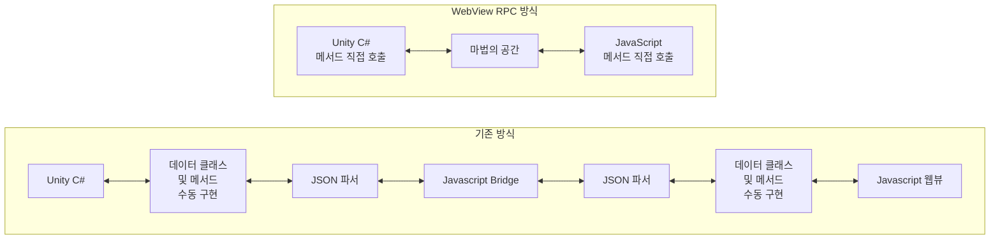

[English](README.md) | [Korean](README_ko.md)

[](https://openupm.com/packages/com.kwanjoong.webviewrpc/)
[](LICENSE.md)
# Unity WebView RPC
유니티 클라이언트(C#)과 웹뷰(HTML, JS)간의 통신에 protobuf를 사용한 grpc와 유사하게 사용할 수 있도록 추상화 레이어를 제공합니다.
기존의 통신방식인 `javascript bridge` 방식을 확장하여 RPC(Remote Procedure Call) 방식과 유사하게 사용할 수 있도록 구현하였습니다.
특정 웹뷰 라이브러리에 종속되지 않도록 Bridge 인터페이스를 제공하여, 어떤 웹뷰 라이브러리를 사용하더라도 동일한 코드로 통신할 수 있도록 설계하였습니다.

## 구조도
WebView RPC는 기존의 `javascript bridge` 방식과 비교하여 작업 흐름이 단순해졌습니다.


### 내부 구현
WebView RPC는 내부적으로는 다음과 같은 구조로 구현되어 있습니다.

1. Unity C# 코드 직접 호출
    - Unity 쪽에서 RPC 인터페이스 함수를 일반 메서드처럼 호출
2. protobuf로 생성된 C# 코드
    - Proto 정의 파일을 바탕으로 자동 생성된 C# 래퍼/스텁
    - RPC 메서드 및 데이터 구조가 protobuf 기반
3. Base64 시리얼라이저 + JavaScript Bridge
    - 실제 바이트 데이터를 Base64로 변환하여 WebView(브라우저)로 전송
    - JavaScript 측에서도 동일 포맷으로 수신
4. protobuf로 생성된 JavaScript 코드
    - 동일한 Proto 정의를 사용해 자동 생성된 JS 코드
    - C#에서 넘어온 직렬화 데이터를 역직렬화한 뒤, JS 메서드를 직접 호출

이처럼 WebView RPC를 사용하면 C#과 JavaScript 간 상호 호출이 단순 함수 호출처럼 동작하며, 반복되는 JSON 파싱/Bridge 처리를 크게 줄일 수 있습니다.
프로젝트 규모가 커질수록 이 구조가 훨씬 간결하고 유지보수하기 쉬워집니다.

## 설치
### 유니티 프로젝트에 WebView RPC 추가하기
1. Nuget 패키지 매니저를 통해 `Protobuf` 패키지를 설치합니다.
2. 패키지 매니저를 통해 설치하거나 OpenUpm을 통해 WebViewRpc 패키지를 설치합니다.
- `Packages/manifest.json`
   ```json
  {
    "dependencies": {
      "com.kwanjoong.webviewrpc": "https://github.com/kwan3854/Unity-WebViewRpc.git?path=/Packages/WebviewRpc"
    }
  }
  ```
- 또는 Package Manager에서
  1. `Window` → `Package Manager` → `Add package from git URL...`
  2. `https://github.com/kwan3854/Unity-WebViewRpc.git?path=/Packages/WebviewRpc` 입력
- 또는 OpenUpm에서
   ```bash
   openupm add com.kwanjoong.webviewrpc
   ```
### 웹뷰 라이브러리 추가하기
- WebView RPC는 패키지로 배포되지 않습니다.
- [Unity-WebViewRpc/Assets/StreamingAssets
  /MocLib](https://github.com/kwan3854/Unity-WebViewRpc/tree/main/Assets/StreamingAssets/MocLib) 하위의 파일들을 javascript 프로젝트에 추가합니다.

### protobuf 파일 생성기 설치
#### protobuf 파일을 C#과 javascript로 변환하기 위해 `protoc` 컴파일러를 사용합니다.
**Mac**
```bash
brew install protobuf
protoc --version  # Ensure compiler version is 3+
```
**Windows**
```bash
winget install protobuf
protoc --version # Ensure compiler version is 3+
```

**Linux**
```bash
apt install -y protobuf-compiler
protoc --version  # Ensure compiler version is 3+
```

#### WebView RPC 코드 생성기 설치
[WebViewRPC 코드 생성기 레포지토리의 Release 페이지](https://github.com/kwan3854/ProtocGenWebviewRpc)에서 최신 릴리즈를 다운로드 받습니다.
- Windows: `protoc-gen-webviewrpc.exe`
- Mac: `protoc-gen-webviewrpc`
- Linux: 제공하지 않습니다.(직접 빌드 필요)


## 빠른 시작
HelloWorld 라는 간단한 RPC 서비스를 구현하고, 유니티 클라이언트와 웹뷰 클라이언트 간의 통신을 확인해보겠습니다.

HelloWorld 서비스는 `HelloRequest` 메시지를 받아 `HelloResponse` 메시지를 반환하는 간단한 RPC 서비스입니다.

우선, C#측이 서버 역할을 하고, javascript 쪽이 클라이언트 역할을 하는 예시를 살펴봅시다.

### protobuf 정의 하기
- protobuf는 서비스의 요청과 응답 형삭을 정의하는데 사용됩니다.
- 유니티 클라이언트와 웹뷰가 통신할 사항이 생겼을 때 회의를 통해 protobuf를 정의합시다.
- 아래의 예시는 `HelloWorld.proto` 파일로, `HelloRequest`, `HelloResponse` 메시지와 `HelloService` 서비스를 정의하였습니다.
- RPC를 요청하는 클라이언트 측(이번예시에서는 javascript)이 SayHello 메서드를 호출하면, 서버 측(이번예시에서는 C#)에서는 SayHello 메서드를 구현하여 요청을 처리하고 응답을 반환합니다.

**HelloWorld.proto**
```protobuf
syntax = "proto3";

package helloworld;

// (C#에서 생성될 때 네임스페이스로 쓰일 수 있음)
option csharp_namespace = "HelloWorld";

// 요청 메시지
message HelloRequest {
  string name = 1;
}

// 응답 메시지
message HelloResponse {
  string greeting = 1;
}

// 간단한 서비스 예시
service HelloService {
  // [단방향] Request -> Response
  rpc SayHello (HelloRequest) returns (HelloResponse);
}
```
### protobuf 파일을 C#과 javascript로 변환하기
- protobuf 파일을 C#과 javascript로 변환하기 위해 `protoc` 컴파일러를 사용합니다.
- `protoc` 컴파일러는 protobuf 파일을 C#과 javascript로 변환하는데 사용됩니다.
- WebView RPC를 위한 [별도의 커스터마이징 된 코드 생성기](https://github.com/kwan3854/ProtocGenWebviewRpc)가 준비되어 있습니다.
- 아래의 명령어를 통해 protobuf 파일을 C#과 javascript로 변환합니다.

**C# 공용 코드 생성하기 (C#측이 서버가 되든, 클라이언트가 되든 공용으로 사용되는 코드)**
```bash
protoc -I. --csharp_out=. HelloWorld.proto 

// 결과물로 HelloWorld.cs 파일이 생성됩니다.
```

**C# 서버 코드 생성하기**
```bash
protoc \
  --plugin=protoc-gen-webviewrpc=./protoc-gen-webviewrpc \
  --webviewrpc_out=cs_server:. \
  -I. HelloWorld.proto
  
// 결과물로 HelloWorld_HelloServiceBase.cs 파일이 생성됩니다.
```

**javascript 공용 코드 생성하기 (javascript측이 클라이언트가 되든, 서버가 되든 공용으로 사용되는 코드)**
> [!IMPORTANT]
> [pbjs 라이브러리가 필요합니다.](https://www.npmjs.com/package/pbjs)
```bash
npx pbjs HelloWorld.proto --es6 hello_world.js

// 결과물로 hello_world.js 파일이 생성됩니다.
```

**javascript 클라이언트 코드 생성하기**
```bash
protoc \
  --plugin=protoc-gen-webviewrpc=./protoc-gen-webviewrpc \
  --webviewrpc_out=js_client:. \
  -I. HelloWorld.proto
  
// 결과물로 HelloWorld_HelloServiceClient.js 파일이 생성됩니다.
```

### 생성된 코드를 각자의 프로젝트에 추가하기
- 생성된 코드를 각자의 프로젝트에 추가합니다.
- Github action을 통해 자동으로 생성된 코드가 생성되고 프로젝트에 추가되도록 할 수 있습니다.

### 브릿지 코드 구현하기
- 브릿지 코드는 C#과 javascript 간의 통신을 중계하는 역할을 합니다.
- 어떠한 웹뷰 라이브러리를 사용하더라도 WebViewRpc 를 사용할 수 있도록 구현이 추상화되어있습니다.
- 각자의 웹뷰 라이브러리에 맞는 브릿지 코드를 구현합니다.
- 아래는 Viewplex의 CanvasWebViewPrefab을 사용하는 예시입니다.

```csharp
using System;
using Vuplex.WebView;
using WebViewRPC;

public class ViewplexWebViewBridge : IWebViewBridge
{
    public event Action<string> OnMessageReceived;
    private readonly CanvasWebViewPrefab _webViewPrefab;
    
    public ViewplexWebViewBridge(CanvasWebViewPrefab webViewPrefab)
    {
        _webViewPrefab = webViewPrefab;
        
        _webViewPrefab.WebView.MessageEmitted += (sender, args) =>
        {
            OnMessageReceived?.Invoke(args.Value);
        };
    }
    
    public void SendMessageToWeb(string message)
    {
        _webViewPrefab.WebView.PostMessage(message);
    }
}
```
```javascript
/***************************************************************
 * VuplexBridge (modified)
 *
 * - JS -> C#: "window.vuplex.postMessage(base64Str)"
 * - C# -> JS: "window.addEventListener('vuplexmessage', ...)"
 *
 * => JS에서 이미 Protobuf -> Base64 변환된 문자열을
 *    'sendMessage(base64)'로 넘기면,
 *    그대로 C#에 전송.
 ***************************************************************/
export class VuplexBridge {
    constructor() {
        this._onMessageCallback = null;
        this._isVuplexReady = false;
        this._pendingMessages = [];

        // 1) 만약 window.vuplex가 이미 있으면 바로 사용
        if (window.vuplex) {
            this._isVuplexReady = true;
        } else {
            // 아직 window.vuplex가 없으므로 'vuplexready' 이벤트 대기
            window.addEventListener('vuplexready', () => {
                this._isVuplexReady = true;
                // 대기중이던 메시지들을 모두 보냄
                for (const msg of this._pendingMessages) {
                    window.vuplex.postMessage(msg);
                }
                this._pendingMessages = [];
            });
        }

        // 2) C# -> JS 메시지: "vuplexmessage" 이벤트
        //    event.value 에 문자열이 들어있음 (C# PostMessage로 보낸)
        window.addEventListener('vuplexmessage', event => {
            const base64Str = event.value; // 보통 Base64
            if (this._onMessageCallback) {
                this._onMessageCallback(base64Str);
            }
        });
    }

    /**
     * JS -> C# 문자열 전송 (base64Str)
     */
    sendMessage(base64Str) {
        // Vuplex는 전달된 인자가 JS object이면 JSON 직렬화해 보내지만,
        // 우리가 'string'을 넘기면 'string' 그대로 보냄.
        if (this._isVuplexReady && window.vuplex) {
            window.vuplex.postMessage(base64Str);
        } else {
            // 아직 vuplex가 준비 안됐으면 대기열에 저장
            this._pendingMessages.push(base64Str);
        }
    }

    /**
     * onMessage(cb): JS가 C#으로부터 문자열을 받을 때 콜백 등록
     */
    onMessage(cb) {
        this._onMessageCallback = cb;
    }
}
```

### C# 서버와 javascript 클라이언트 코드 작성하기

```csharp
public class WebViewRpcTester : MonoBehaviour
{
    [SerializeField] private CanvasWebViewPrefab webViewPrefab;

    private async void Start()
    {
        await InitializeWebView(webViewPrefab);
        
        // 브릿지 생성
        var bridge = new ViewplexWebViewBridge(webViewPrefab);
        // 서버 생성
        var server = new WebViewRPC.WebViewRpcServer(bridge)
        {
            Services =
            {
                // HelloService를 바인딩
                HelloService.BindService(new HelloWorldService()),
                // 다른 서비스도 추가 가능
            }
        };
        
        // 서버 시작
        server.Start();
    }
    
    private async Task InitializeWebView(CanvasWebViewPrefab webView)
    {
        // 예시로 사용한 WebViewPrefab은 Viewplex의 CanvasWebViewPrefab을 사용하였습니다.
        await webView.WaitUntilInitialized();
        webView.WebView.LoadUrl("http://localhost:8081");
        await webView.WebView.WaitForNextPageLoadToFinish();
    }
}
```
```csharp
using HelloWorld;
using UnityEngine;

namespace SampleRpc
{
    // HelloWorldService를 상속받아 SayHello 메서드를 구현
    // HelloWorldService는 HelloWorld.proto에서 생성된 코드입니다.
    public class HelloWorldService : HelloServiceBase
    {
        public override HelloResponse SayHello(HelloRequest request)
        {
            Debug.Log($"Received request: {request.Name}");
            return new HelloResponse()
            {
                // 요청을 받아 응답을 반환
                Greeting = $"Hello, {request.Name}!"
            };
        }
    }
}
```
```javascript
// 1) 브리지 생성
const bridge = new VuplexBridge();
// 2) RpcClient 생성
const rpcClient = new WebViewRpcClient(bridge);
// 3) HelloServiceClient
const helloClient = new HelloServiceClient(rpcClient);

document.getElementById('btnSayHello').addEventListener('click', async () => {
    try {
        const reqObj = {name: "Hello World! From WebView"};
        console.log("Request to Unity: ", reqObj);

        const resp = await helloClient.SayHello(reqObj);
        console.log("Response from Unity: ", resp.greeting);
    } catch (err) {
        console.error("Error: ", err);
    }
});
```
### 실행하기
- 유니티에서 WebViewRpcTester 스크립트를 실행하고, 웹뷰를 띄웁니다.
- 웹뷰에서 버튼을 클릭하면, 유니티에서 HelloService를 통해 요청을 처리하고 응답을 반환합니다.

### 반대의 경우 (C# 클라이언트, javascript 서버)
- 반대의 경우도 동일하게 구현이 가능합니다.
- 이미 공용 코드가 생성되어 있으므로, C# 클라이언트와 javascript 서버 코드를 생성 합니다.

**C# 클라이언트 코드 생성하기**
```bash
protoc \
  --plugin=protoc-gen-webviewrpc=./protoc-gen-webviewrpc \
  --webviewrpc_out=cs_client:. \
  -I. HelloWorld.proto
```
**javascript 서버 코드 생성하기**
```bash
protoc \
  --plugin=protoc-gen-webviewrpc=./protoc-gen-webviewrpc \
  --webviewrpc_out=js_server:. \
  -I. HelloWorld.proto
```

**C# 클라이언트 코드 작성하기**
```csharp
public class WebViewRpcTester : MonoBehaviour
{
    [SerializeField] private CanvasWebViewPrefab webViewPrefab;

    private void Awake()
    {
        Web.ClearAllData();
    }

    private async void Start()
    {
        await InitializeWebView(webViewPrefab);
        
        // 브릿지 생성
        var bridge = new ViewplexWebViewBridge(webViewPrefab);
        // RpcClient 생성
        var rpcClient = new WebViewRPC.WebViewRpcClient(bridge);
        // HelloServiceClient 생성
        var client = new HelloServiceClient(rpcClient);
        
        // 요청 보내기
        var response = await client.SayHello(new HelloRequest()
        {
            Name = "World"
        });
        
        // 응답 확인
        Debug.Log($"Received response: {response.Greeting}");
    }
    
    private async Task InitializeWebView(CanvasWebViewPrefab webView)
    {
        await webView.WaitUntilInitialized();
        webView.WebView.LoadUrl("http://localhost:8081");
        await webView.WebView.WaitForNextPageLoadToFinish();
    }
}
```

**javascript 서버 코드 작성하기**
```javascript
// 1) 브리지 생성
const bridge = new VuplexBridge();
// 2) RpcServer 생성
const rpcServer = new WebViewRpcServer(bridge);
// 3) 서비스 구현체 생성
const impl = new MyHelloServiceImpl();
// 4) 서비스 바인딩
const def = HelloService.bindService(impl);
// 5) 서비스 등록
rpcServer.services.push(def);
// 6) 서버 시작
rpcServer.start();
```
```javascript
import { HelloServiceBase } from "./HelloWorld_HelloServiceBase.js";

// 자동 생성된 HelloWorld_HelloServiceBase.js의 HelloServiceBase를 상속받아 구현
export class MyHelloServiceImpl extends HelloServiceBase {
    SayHello(requestObj) {
        // 받은 요청을 확인
        console.log("JS Server received: ", requestObj);
        
        // 요청을 받아 응답을 반환
        return { greeting: "Hello from JS! I got your message: " + requestObj.name };
    }
}

```

## License
This project is licensed under the MIT License - see the [LICENSE.md](LICENSE.md) file for details.